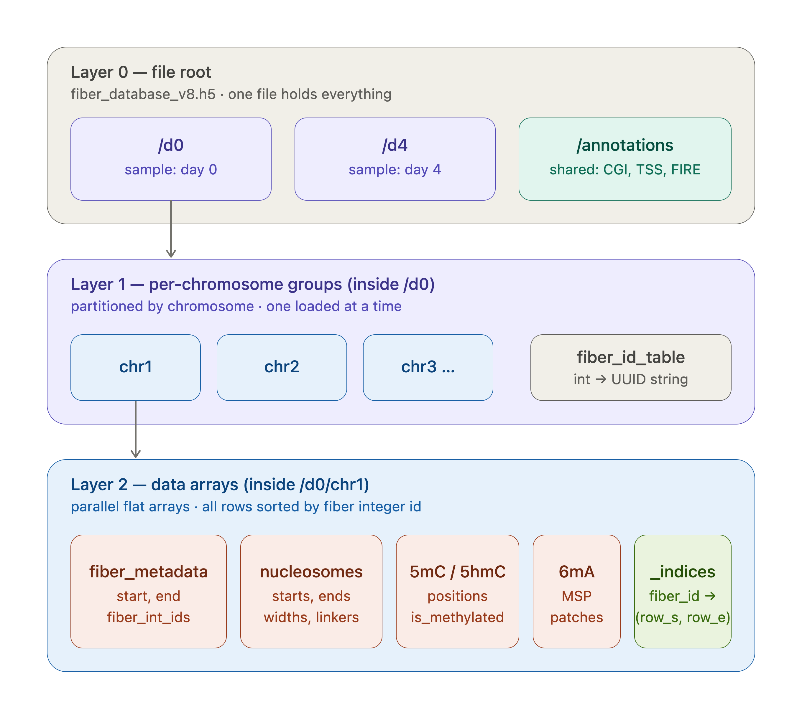

# MEI-Fiber

[](https://github.com/mc3365/MEI-Fiber/actions/workflows/tests.yml)
[](https://www.python.org/downloads/)
[](https://opensource.org/licenses/MIT)

**Multimodal Epigenetic Integration with Fiber-seq.**

MEI-Fiber is a single-molecule epigenomic integration framework for long-read
Fiber-seq data.

`MEI-Fiber` provides infrastructure for joint single-molecule analysis of DNA methylation,
nucleosome positioning, and chromatin accessibility on individual long reads from Oxford
Nanopore (ONT) and PacBio Fiber-seq experiments. It uses an HDF5-backed storage layer
with spatial indexing for genome-scale per-molecule queries.

## Status

**Alpha (v0.5.0).** ONT extraction, HDF5 building, indexed queries, benchmarks, and
visualization have been validated end to end. PacBio extraction and normalization use
the same HDF5 schema for 5mC, 6mA, MSPs, nucleosomes, and optional FIRE accessibility
calls. The PacBio FIRE workflow can regenerate `Cov.bed`, build the enhancer-by-fiber
object, rank co-accessible pairs and stitched regions, and compare those outputs with
the legacy workflow. APIs may still change.

## What it does

`MEI-Fiber` integrates the outputs of established modification callers (`modkit`,
`fibertools-rs`) into a unified per-fiber data structure that supports joint queries
across modification types. Existing tools handle modification
extraction excellently but produce separate files in separate formats with no efficient
way to ask single-molecule questions across them. `MEI-Fiber` provides the missing
integration layer.

| Layer | Module | Description |
|-------|--------|-------------|
| **Extraction** | `mei_fiber.extract` | Wraps `modkit` and `fibertools-rs` with validated ONT defaults and PacBio normalization |
| **Storage** | `mei_fiber.db` | HDF5 schema with spatial indexing and memory-mapped access |
| **Visualization** | `mei_fiber.viz` | Per-molecule heatmap and related plots |
| **Co-accessibility** | `mei_fiber.analysis.coaccessibility` | FIRE peak filtering/stitching, PacBio coverage, object construction, and pair/region ranking |
| **Benchmark** | `mei_fiber.benchmark` | Query/storage benchmarks and legacy co-accessibility validation |

## Data Structure

MEI-Fiber writes one HDF5 file containing all samples and shared annotations. Each
sample is partitioned by chromosome, and each chromosome stores molecular features
as parallel flat arrays. Rows are sorted by integer fiber ID, and `_indices` maps
each fiber ID to its row range in every feature array. This keeps per-fiber lookups
fast without repeatedly scanning whole chromosomes.



## Quick install

```bash
git clone https://github.com/mc3365/MEI-Fiber.git
cd MEI-Fiber
conda env create -f environments/ont.yml
conda activate mei-fiber-ont
pip install -e ".[dev,viz]"
```

MEI-Fiber was renamed from `PACKAGE` in v0.5.0. New scripts should use the
`mei-fiber` command and `mei_fiber` Python namespace. The former `PACKAGE` command
and namespace remain compatibility aliases for existing HPC workflows.

## Quickstart

```bash
# Step 1: extract modifications from BAMs
mei-fiber extract --platform ont --config configs/my_ont.yaml --samples d0

# Step 2: build the HDF5 database and spatial-index sidecar
mei-fiber build --config configs/my_ont.yaml --build-index

# Step 3: query one region
mei-fiber query \
  --db /path/to/output/fiber_database.h5 \
  --region chr1:1000000-1100000 \
  --sample d0
```

Or as a Python library:

```python
from mei_fiber.db import FiberDatabase
from mei_fiber.viz import single_molecule_heatmap

with FiberDatabase("fiber_database.h5") as db:
    fig = single_molecule_heatmap(db, "chr1", 1_000_000, 1_100_000, sample="d0")
    fig.savefig("ont_region.png", dpi=200)
```

For PacBio data, use `mei-fiber extract --platform pacbio` with a PacBio config, or
normalize existing `ft extract` outputs before building the database. See the
[tutorial](docs/tutorial.md#pacbio-workflow) for the tested end-to-end workflow.

PacBio co-accessibility support starts from a FIRE-annotated BAM or the
`acc.model.results.bed` generated from it by `ft fire --extract`. The full upstream
FIRE snakemake/modeling workflow is not bundled; for exact reproduction of legacy
co-accessibility outputs, use the same extracted FIRE BED and fibertools version
provenance as the original run.

Start with the [tutorial](docs/tutorial.md), then use the
[parameter reference](docs/parameters.md) for every YAML and CLI option. The
[benchmark and validation guide](docs/benchmark.md) explains outputs and figures,
and the [step-by-step ONT workflow](STEP_BY_STEP_GITHUB.md) provides a focused ONT
walkthrough.

## Supported platforms

- **Oxford Nanopore (ONT)**: validated with `modkit extract` and `ft extract`
- **PacBio**: validated for fibertools-derived 5mC, 6mA, MSP, nucleosome, and
  optional `ft fire --extract` accessibility-call layers after normalization into the
  shared HDF5 schema; FIRE co-accessibility coverage, object construction, ranking,
  and legacy-output validation are also available

The package stores the FIRE/accessibility input layer needed by the legacy
co-accessibility workflow and can regenerate the legacy `Cov.bed`,
enhancer-by-fiber JSON object, and ranked constituent-element pair tables from that
layer. MEI-Fiber does not run the upstream FIRE model that creates a FIRE-annotated
BAM. More specialized downstream biological interpretation remains workflow-specific.

## Design philosophy

`MEI-Fiber` wraps rather than reimplements established modification callers. The novel
contribution is the integration layer: joint single-molecule storage, spatial indexing
across modification types, and the cross-platform abstraction. Reusable operations
such as annotation summaries, single-molecule visualization, and FIRE
co-accessibility ranking are packaged, while study-specific biological interpretation
remains downstream.

## Citation

If you use `MEI-Fiber` in published work, please cite:

> Cui, M. et al. (2026). *MEI-Fiber: a unified framework for single-molecule integration
> of long-read Fiber-seq data.* [Manuscript in preparation].

A `CITATION.cff` file is included for automated citation generation.

## License

MIT. See [LICENSE](LICENSE).

## Contact

Meiying Cui — meiying.cui@yale.edu
