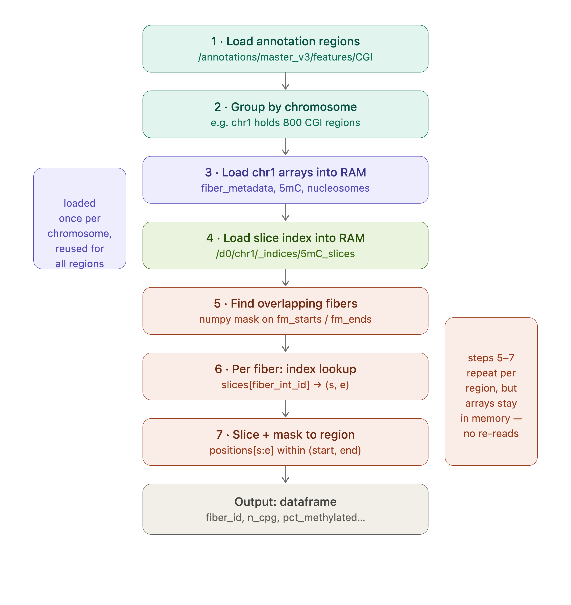

# PACKAGE

Single-molecule epigenomic analysis for long-read Fiber-seq data.

## Overview

`PACKAGE` provides a unified analytical framework for joint analysis of:

- DNA methylation (5mC, 5hmC)
- 6mA-mediated chromatin accessibility
- Nucleosome positioning

...on individual long reads.

The package uses an HDF5-backed storage layer with spatial indexing for genome-scale
per-molecule queries.

ONT extraction, database building, indexed queries, benchmarks, and visualization are
validated end to end. PacBio extraction normalizes fibertools outputs into the same
HDF5 schema for 5mC, 6mA, MSP, nucleosome, and optional FIRE/accessibility-call
layers. PACKAGE can then regenerate FIRE coverage, build the enhancer-by-fiber
object, rank co-accessible constituent pairs and stitched regions, and validate those
outputs against a legacy run.

## Current Capabilities

| Stage | ONT | PacBio |
| --- | --- | --- |
| Extract | modkit 5mC/5hmC; fibertools 6mA, MSP, nucleosome | fibertools 5mC, 6mA, MSP, nucleosome; optional `ft fire --extract` |
| Build | Multi-sample HDF5, annotations, per-fiber indices, spatial-index sidecar | Same shared schema plus optional FIRE accessibility layer |
| Query | Region, per-fiber, and annotation-centered summaries | Same query API |
| Visualize | ECDF, centered heatmap/metaplot, single-molecule tracks | Shared HDF5 visualizations where requested layers are present |
| Validate | Storage, random-window, and annotation-query benchmarks | Legacy FIRE `Cov.bed`, object, pair, cluster, score, and rank comparison |

FIRE model fitting itself is upstream of PACKAGE. PACKAGE begins with a Fiber-seq or
FIRE-annotated BAM and its extracted files; it does not run the upstream FIRE
Snakemake/modeling workflow.

## HDF5 Layout

PACKAGE stores all samples and shared annotations in one HDF5 file. The file is
organized as three nested layers: file root, sample/chromosome groups, and flat
per-chromosome arrays. Within each chromosome, molecular features are sorted by
integer fiber ID. The `_indices` group maps each fiber ID to the row range for that
fiber in each feature array, so per-fiber lookups do not require scanning the full
chromosome.

Annotation queries use the spatial index to identify overlapping fibers and the
per-layer `_indices` tables to retrieve only molecular rows belonging to those fibers.

## See also

- [Installation](installation.md) — getting started
- [Tutorial](tutorial.md) — end-to-end ONT and PacBio/FIRE workflows
- [Parameter Reference](parameters.md) — command and YAML options
- [Benchmark and Validation](benchmark.md) — performance and equivalence testing
- [API Reference](api.md) — module documentation
