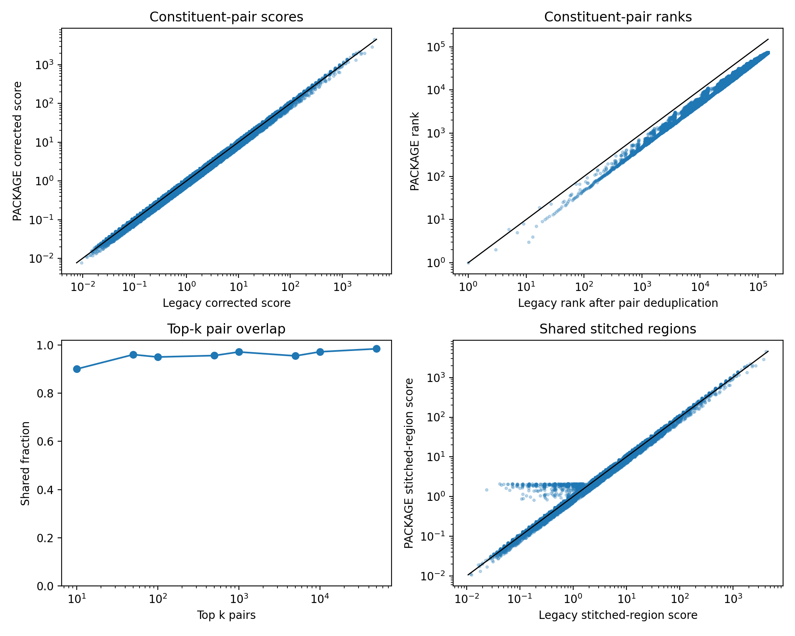
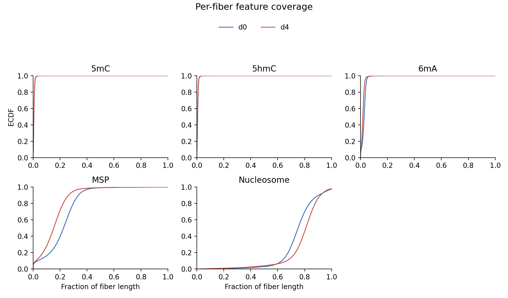
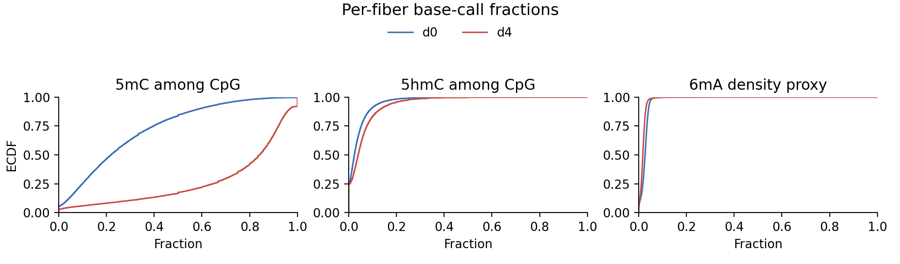
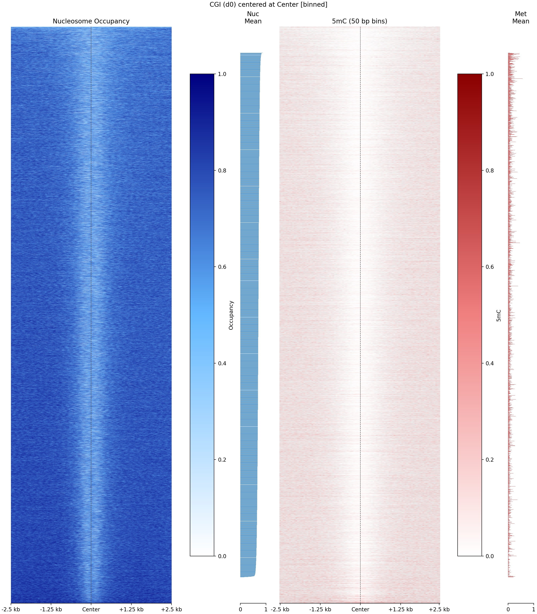
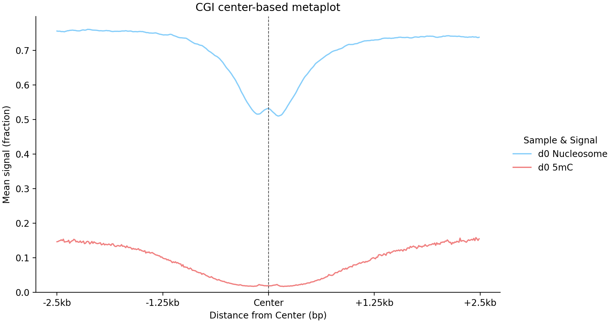
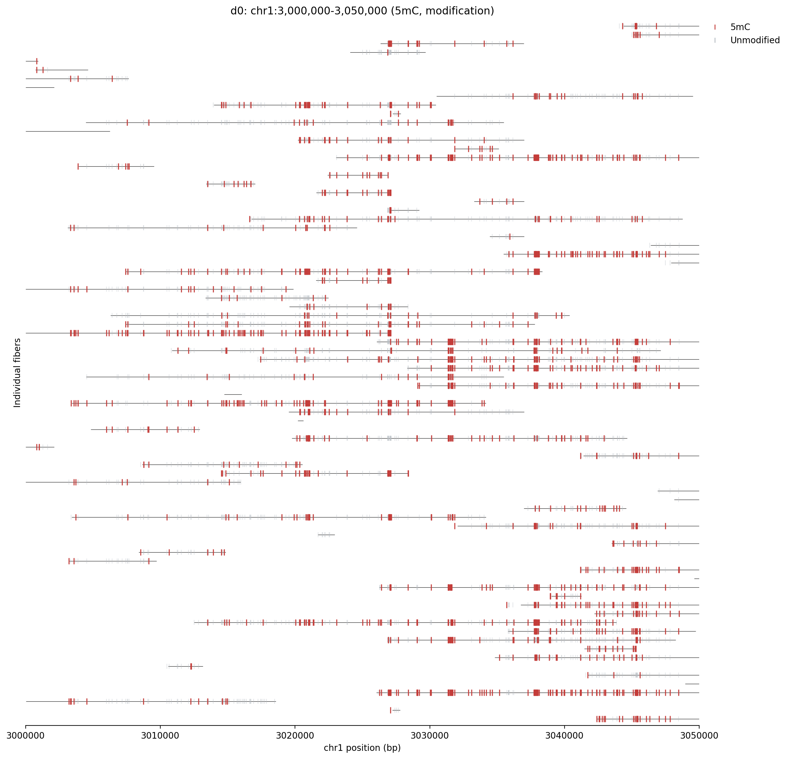
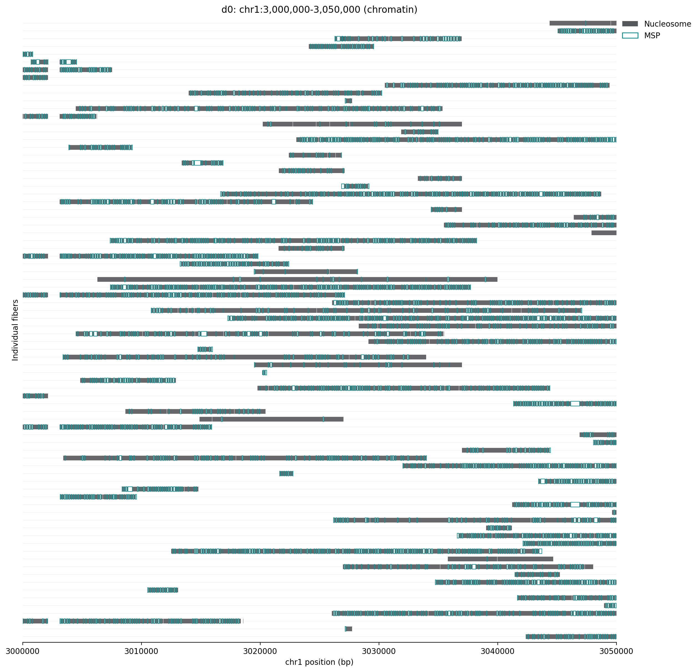
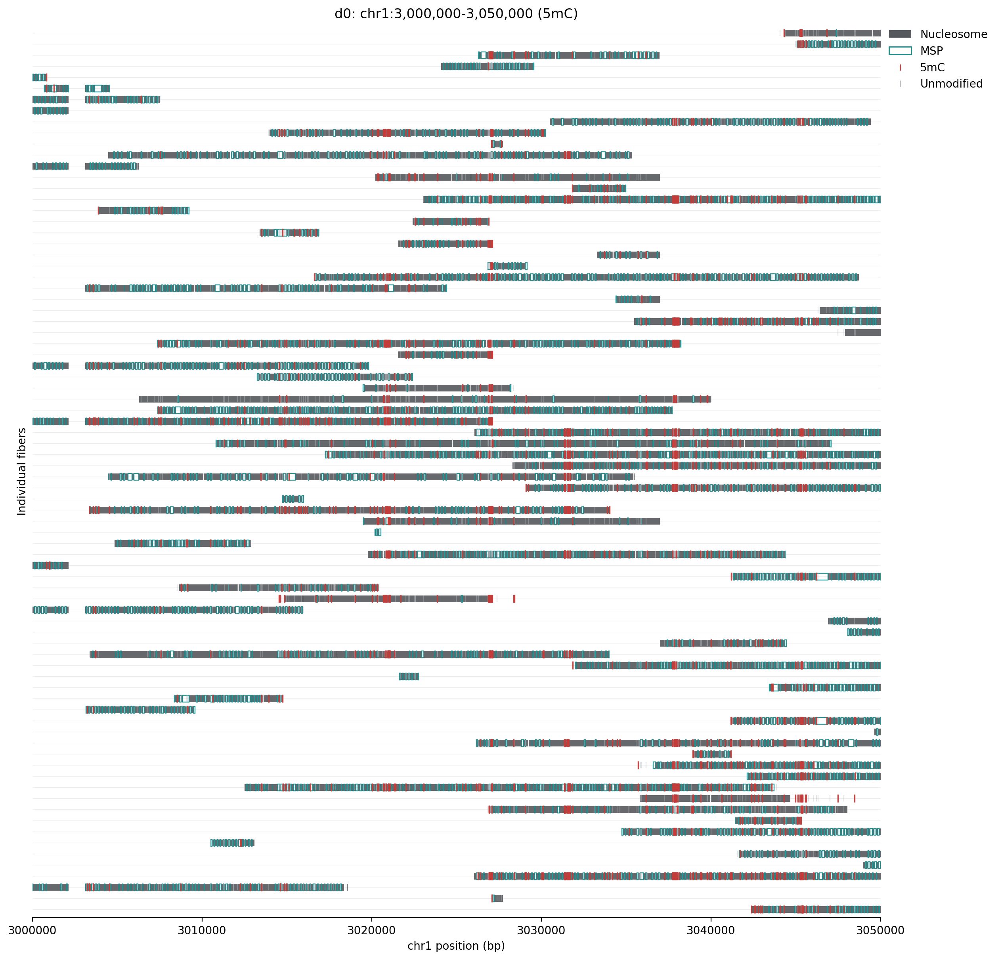

# Tutorial

MEI-Fiber uses the same HDF5 schema for ONT and PacBio after platform-specific
extraction outputs have been converted into common intermediate files.

Choose the path that matches your input and analysis goal:

| Starting point | Follow |
| --- | --- |
| ONT BAM with MM/ML tags | [ONT workflow](#ont-workflow) |
| PacBio Fiber-seq BAM | [PacBio workflow](#pacbio-workflow) through HDF5 build/query |
| PacBio FIRE-annotated BAM | PacBio workflow plus [FIRE co-accessibility](#fire-co-accessibility-preparation) |
| Existing legacy and MEI-Fiber FIRE outputs | [Co-accessibility validation](#validate-against-a-legacy-run) |

For a first run, use a small coordinate-sliced BAM and a separate output directory.
After extraction, inspect the manifest; after build, run `mei-fiber info` and one region
query before submitting genome-scale analyses.

## ONT Workflow

### Prepare the configuration

Copy `configs/ont_template.yaml`, replace every `/path/to` value, and keep the 5mC
and 5hmC layer paths identical. The shared modkit table contains both call types.
The configured methylation threshold is `0.5`; binarization happens during the HDF5
build while raw probabilities are retained.

The BAM must be coordinate sorted, indexed, aligned to the configured reference, and
contain MM/ML tags. MEI-Fiber checks these requirements before extraction.

For all YAML fields and command-line options, see the
[Parameter Reference](parameters.md).

### Extract and build

```bash
mei-fiber extract --platform ont --config configs/my_ont.yaml
mei-fiber build --config configs/my_ont.yaml
mei-fiber info /path/to/output/fiber_database.h5
```

Existing extraction outputs are reused when `overwrite: false`. Each extraction writes
`MEI-Fiber_manifest_<sample>.json` with input QC, tool versions, commands, and outputs.
With `build.build_spatial_index: true`, the build also writes
`fiber_database.index.pkl` beside the HDF5 file. Keep the sidecar with the database;
it is used for fast coordinate queries.

### Query a region

```bash
mei-fiber query \
  --db /path/to/output/fiber_database.h5 \
  --region chr1:3000000-5000000 \
  --sample sample1
```

## PacBio Workflow

PacBio support currently covers:

- nucleosomes;
- 5mC;
- 6mA;
- MSPs;
- optional FIRE/accessibility calls from `ft fire --extract`.

PacBio 5hmC is not produced by this pathway. The optional `fire_accessibility`
layer stores the legacy co-accessibility input from `acc.model.results.bed`: column
10 is the FIRE/accessibility model score and column 11 is the haplotype when present.
This is distinct from the raw 0-255 `fire` list in `ft extract --all`.

FIRE modeling itself is upstream of MEI-Fiber. In the legacy PacBio workflow, the
input to FIRE was a sorted fibertools BAM, FIRE produced a `*.fire.bam`, and then
`ft fire --extract` converted that FIRE-annotated BAM into
`acc.model.results.bed`. MEI-Fiber starts from the Fiber-seq/FIRE BAM and its
extracted BED outputs; it does not currently run the full FIRE snakemake workflow.

### Prepare raw fibertools outputs

If starting from a PacBio Fiber-seq or FIRE BAM, run fibertools extraction. A
typical command is:

```bash
ft extract \
  --nuc pacbio_nuc.bed.gz \
  --msp pacbio_msp.bed.gz \
  --m6a pacbio_6ma.bed.gz \
  --cpg pacbio_5mc.bed.gz \
  --all pacbio_all.tsv.gz \
  --simplify \
  yaleFiberAug19_2025.fire.bam

ft fire --extract \
  yaleFiberAug19_2025.fire.bam \
  acc.model.results.bed
```

If `samples[].bam` points to a FIRE-annotated BAM and the YAML includes a
`fire_accessibility` output path, `mei-fiber extract --platform pacbio` can run
`ft fire --extract` for you. For strict reproduction of an older co-accessibility
analysis, prefer the exact `acc.model.results.sort.bed` that was used by that
analysis, because `ft fire --extract` output can vary with fibertools version or
runtime environment even when the source FIRE BAM is unchanged. Record the `ft
--version` value in the manifest or run log.

`pacbio_5mc.bed.gz` is useful for inspection, but MEI-Fiber uses
`pacbio_all.tsv.gz` for the packaged 5mC layer because that table contains named
`ref_5mC` and `5mC_qual` fields. The PacBio normalizer skips missing reference
positions such as `-1` and `.`.

### Normalize PacBio outputs for mei-fiber build

The normalization step is file-format normalization, not biological signal
normalization. It checks the raw fibertools files and writes the same
intermediate formats used by the HDF5 builder:

| Raw PacBio file | Builder-ready file |
| --- | --- |
| `pacbio_all.tsv.gz` | modkit-like 5mC TSV/TSV.GZ |
| `pacbio_6ma.bed.gz` | BED12-style 6mA |
| `pacbio_msp.bed.gz` | BED12-style MSP |
| `pacbio_nuc.bed.gz` | flattened nucleosome CSV |
| `acc.model.results.bed` | optional `fire_accessibility` layer |

For an already extracted test directory:

```bash
PACBIO_DIR=/path/to/pacbio_mm
OUT=$PACBIO_DIR/package_test
mkdir -p "$OUT"

python - <<PY
from pathlib import Path
from mei_fiber.extract.pacbio import (
    inspect_pacbio_all,
    convert_pacbio_all_5mc_to_modkit,
    normalize_fibertools_block_bed,
)
from mei_fiber.extract.ont import flatten_nucleosome_bed12

pacbio = Path("$PACBIO_DIR")
out = Path("$OUT")

print(inspect_pacbio_all(pacbio / "pacbio_all.tsv.gz"))

print(convert_pacbio_all_5mc_to_modkit(
    pacbio / "pacbio_all.tsv.gz",
    out / "pacbio_5mc_for_MEI_Fiber.tsv.gz",
))

print(normalize_fibertools_block_bed(
    pacbio / "pacbio_6ma.bed.gz",
    out / "pacbio_6ma_for_MEI_Fiber.bed",
    expected="single_base",
))

print(normalize_fibertools_block_bed(
    pacbio / "pacbio_msp.bed.gz",
    out / "pacbio_msp_for_MEI_Fiber.bed",
    expected="interval",
))

normalize_fibertools_block_bed(
    pacbio / "pacbio_nuc.bed.gz",
    out / "pacbio_nuc_for_MEI_Fiber.bed",
    expected="interval",
)
n = flatten_nucleosome_bed12(
    out / "pacbio_nuc_for_MEI_Fiber.bed",
    out / "pacbio_nuc_features.csv",
)
print({"nucleosome_rows": n})
PY
```

Check the normalized BED files before building:

```bash
python - <<'PY'
for p in [
    "pacbio_msp_for_MEI_Fiber.bed",
    "pacbio_6ma_for_MEI_Fiber.bed",
    "pacbio_nuc_for_MEI_Fiber.bed",
]:
    print("\nChecking", p)
    with open(p) as f:
        for i, line in zip(range(1, 1001), f):
            c = line.rstrip("\n").split("\t")
            assert len(c) == 12, (p, i, len(c))
            block_count = int(c[9])
            sizes = [x for x in c[10].rstrip(",").split(",") if x]
            starts = [x for x in c[11].rstrip(",").split(",") if x]
            assert block_count == len(sizes) == len(starts), (
                p, i, block_count, len(sizes), len(starts)
            )
    print("PASS")
PY
```

### Build and query a PacBio HDF5

Start from `configs/pacbio_template.yaml`, then point the layer paths to the
normalized files:

```yaml
samples:
  - name: pacbio_test
    layers:
      nucleosomes: /path/to/package_test/pacbio_nuc_features.csv
      5mC: /path/to/package_test/pacbio_5mc_for_MEI_Fiber.tsv.gz
      6mA: /path/to/package_test/pacbio_6ma_for_MEI_Fiber.bed
      msp: /path/to/package_test/pacbio_msp_for_MEI_Fiber.bed
      fire_accessibility: /path/to/package_test/acc.model.results.bed

annotations:
  master: /path/to/master_annotations_basic.uniqueID.bed
```

Build and inspect:

```bash
mei-fiber build --config configs/my_pacbio.yaml
mei-fiber info /path/to/output/pacbio_fiber_database.h5
```

Then query a coordinate window:

```bash
mei-fiber query \
  --db /path/to/output/pacbio_fiber_database.h5 \
  --sample pacbio_test \
  --region chr1:3000000-3050000
```

And test per-fiber accessors:

```bash
python - <<'PY'
from mei_fiber import FiberDatabase

db = "/path/to/output/pacbio_fiber_database.h5"
sample = "pacbio_test"
chrom = "chr1"

with FiberDatabase(db) as fdb:
    fibers = fdb.get_fibers_at(chrom, 3000000, 3050000, sample=sample)
    print("n fibers:", len(fibers))
    first = fibers[0] if fibers else None
    print("first fiber:", first)

    if first:
        print("nucleosomes:", fdb.get_nucleosomes(first, chrom, sample=sample))
        print("5mC:", fdb.get_methylation(first, chrom, mod_type="5mC", sample=sample))
        print("6mA:", fdb.get_methylation(first, chrom, mod_type="6mA", sample=sample))
        print("MSP:", fdb.get_msp(first, chrom, sample=sample))
        print("FIRE:", fdb.get_fire_accessibility(first, chrom, sample=sample))
PY
```

### Annotation queries

Annotation BED files are written during `mei-fiber build`. If the HDF5 was built
without annotations, rebuild with the `annotations.master` path added to the YAML.
The package does not yet expose a safe command for adding annotations to an
existing HDF5 file in place.

After rebuilding with annotations:

```bash
python - <<'PY'
from mei_fiber import FiberDatabase

db = "/path/to/output/pacbio_fiber_database.h5"

with FiberDatabase(db) as fdb:
    print(fdb.list_annotations())
    result = fdb.query_annotation_fast(
        "CGI",
        sample="pacbio_test",
        max_regions=50,
        feature_types=["nucleosomes", "5mC", "6mA", "msp", "fire_accessibility"],
    )
    print(result.shape)
    print(result.head())
PY
```

### FIRE co-accessibility preparation

MEI-Fiber does not fit the upstream FIRE model. Begin with its FIRE-annotated BAM,
FDR FIRE peaks, and the accessibility BED generated by `ft fire --extract`. The
accessibility BED is packaged as `fire_accessibility` during `mei-fiber build`.

Prepare the constituent intergenic peaks and stitched regions from the FDR peaks:

```bash
mei-fiber coaccess prepare \
  --peaks /path/to/FDR-FIRE-peaks_merge.bed \
  --genes /path/to/gencode.vM23.basic.annotation.gff3 \
  --chrom-sizes /path/to/mm10.chrom.sizes \
  --outdir /path/to/coaccess_prepared
```

This stage inherits the original filtering and stitching model:

1. Read gene features from the GFF3/GTF file.
2. Ignore `lncRNA` and pseudogene gene types as roadblocks.
3. Extend plus-strand genes 500 bp upstream and minus-strand genes 500 bp downstream.
4. Retain FIRE peaks outside those expanded genes.
5. Stitch neighboring retained peaks separated by no more than 12.5 kb, unless an
   unexpanded blocking gene lies between them.

It writes:

- `FIRE_peaks_intergenic.bed`;
- `FIRE_stitched.bed`;
- `coaccess_prepare_manifest.json` with input checksums, parameters, and counts.

The defaults use the standard conversion from 1-based inclusive GFF coordinates to
0-based half-open BED coordinates. For a historical comparison run, add
`--legacy-gff-coordinates` to reproduce the old direct-coordinate interpretation.
MEI-Fiber retains valid terminal peaks that the old loop could omit.

### FIRE co-accessibility coverage

If the PacBio HDF5 was built with `fire_accessibility`, MEI-Fiber can now regenerate
the legacy `Cov.bed` input using the prepared regions and the HDF5 FIRE layer:

```bash
mei-fiber coaccess cov \
  --db /path/to/output/pacbio_fiber_database.h5 \
  --sample pacbio_test \
  --stitched /path/to/coaccess_prepared/FIRE_stitched.bed \
  --peaks /path/to/coaccess_prepared/FIRE_peaks_intergenic.bed \
  --out /path/to/Cov_MEI_Fiber.bed
```

The output has the same nine columns as the legacy file:

```text
element_chr  element_start  element_end  stitched_chr  stitched_start  stitched_end  fiber_id  fire_score  overlap_bp
```

During HDF5 build, MEI-Fiber attaches `fire_accessibility` calls only to fibers that
exist in the packaged molecule table for that chromosome. In validation against the
legacy PacBio co-accessibility run, using the original large
`acc.model.results.sort.bed` reproduced `Cov.bed` to within three rows out of
6.7 million; the missing rows were FIRE-only fibers absent from the packaged fiber
table. This is expected from the HDF5 design, where the core fiber/nucleosome layer
defines the molecule universe and optional layers attach to those fibers.

To make the legacy enhancer-by-fiber JSON object:

```bash
mei-fiber coaccess object \
  --cov /path/to/Cov_MEI_Fiber.bed \
  --out /path/to/scored_MEI_Fiber_obj.json
```

To rank co-accessible constituent FIRE element pairs and stitched regions:

```bash
mei-fiber coaccess rank \
  --object /path/to/scored_MEI_Fiber_obj.json \
  --outdir /path/to/coaccess_rank
```

This writes:

- `ce_rank.txt`: constituent FIRE element pairs sorted by the legacy modified
  odds-ratio-like co-accessibility score;
- `cluster_rank.txt`: stitched FIRE regions sorted by their maximum constituent
  pair score. The legacy script had cluster splitting disabled by default, so this
  table summarizes each stitched region as one cluster;
- `ce_pairs_ranked.svg` and `clusters_ranked.svg` when `matplotlib` is available.

The ranking step uses the old FIRE score threshold of `0.10` to decide whether a
constituent element is accessible on a fiber. It also applies the legacy
distance-correction pass by default. Use `--no-distance-correct` for a simpler
smoke test.

### Validate the preparation stage

For a dataset with historical prepared BED files, run `coaccess prepare` twice:

1. once with the standard coordinate mode for the new analysis;
2. once with `--legacy-gff-coordinates` for comparison with the historical output.

Compare interval counts first, then exact shared rows:

```bash
wc -l \
  legacy/FIRE_peaks_intergenic.bed \
  prepared_legacy/FIRE_peaks_intergenic.bed \
  legacy/FIRE_stitched.bed \
  prepared_legacy/FIRE_stitched.bed

LC_ALL=C sort -u legacy/FIRE_peaks_intergenic.bed > legacy.peaks.sorted.bed
LC_ALL=C sort -u prepared_legacy/FIRE_peaks_intergenic.bed > package.peaks.sorted.bed
comm -3 legacy.peaks.sorted.bed package.peaks.sorted.bed > peak_membership_difference.tsv

LC_ALL=C sort -u legacy/FIRE_stitched.bed > legacy.stitched.sorted.bed
LC_ALL=C sort -u prepared_legacy/FIRE_stitched.bed > package.stitched.sorted.bed
comm -3 legacy.stitched.sorted.bed package.stitched.sorted.bed > stitched_membership_difference.tsv
```

Inspect differences at chromosome ends separately because MEI-Fiber intentionally
retains valid final peaks. After the BED comparison, continue through `cov`,
`object`, and `rank`, then run the co-accessibility validation benchmark below.

### Validate against a legacy run

When legacy `Cov.bed`, object, pair-rank, and cluster-rank outputs are available,
compare the full workflow with the validation benchmark:

```bash
python -m mei_fiber.benchmark.coaccessibility \
  --legacy-ce /path/to/legacy/ce_rank.txt \
  --mei-fiber-ce /path/to/package/ce_rank.txt \
  --legacy-cluster /path/to/legacy/cluster_rank.txt \
  --mei-fiber-cluster /path/to/package/cluster_rank.txt \
  --legacy-cov /path/to/legacy/Cov.sorted.bed \
  --mei-fiber-cov /path/to/package/Cov.sorted.bed \
  --cov-difference /path/to/Cov.missing_from_MEI_Fiber.bed \
  --legacy-object /path/to/legacy/scored_obj.json \
  --mei-fiber-object /path/to/package/scored_MEI_Fiber_obj.json \
  --outdir benchmark/coaccess_validation
```

The comparison canonicalizes legacy directional pair rows (`A -> B` and `B -> A`)
into one unordered biological pair. It reports exact membership, score and rank
correlations, top-k overlap, `Super` call agreement, and order-independent
fingerprints for the large Cov files.

In the validated PacBio dataset, MEI-Fiber recovered all 74,435 unique constituent
pairs and every one of 15,287 legacy stitched regions. Pair-score Pearson correlation
was 0.990, rank Spearman correlation was 0.997, and pair `Super` calls agreed for
99.93% of pairs. MEI-Fiber retained 601 additional stitched regions that are all
candidates for a legacy `0.5` sentinel collision. The MEI-Fiber Cov file differed by
three documented fibers; adding those known rows produced an exact multiset match to
the 6.7-million-row legacy Cov file.



Corrected scores are highly concordant but not numerically identical because the
distance fitting and legacy sentinel handling differ. See
[Benchmark and Validation](benchmark.md#pacbio-fire-co-accessibility-validation) for
a panel-by-panel explanation.

### Current update behavior

HDF5 technically supports append-mode updates, but MEI-Fiber currently treats a
database build as a reproducible artifact: annotations and molecular layers are
written during `mei-fiber build`. To add annotations or `fire_accessibility`, rebuild
from the same intermediate files with those paths included.

## How a Query Uses the Database

For annotation-centered queries such as "find CGI methylation in one sample",
MEI-Fiber first loads the shared annotation regions, groups them by chromosome, and
then works chromosome by chromosome. The chromosome-level arrays are loaded once
and reused across all regions on that chromosome.

Within a chromosome, MEI-Fiber finds overlapping fibers from the fiber metadata
arrays, then uses `_indices` to jump directly to each fiber's row range in the
requested feature arrays. For example, the 5mC slice index maps a fiber integer
ID to the start and end rows for that fiber's CpG calls. MEI-Fiber slices only that
range and masks it to the query interval, then returns per-fiber summaries such
as CpG count and percent methylated.


## Visualization Examples

Install the optional plotting dependencies before running these examples:

```bash
pip install -e ".[viz]"
```

The examples below use an existing MEI-Fiber HDF5 database. They are intended as
small, inspectable outputs rather than final manuscript layouts.

### ECDF Summary Plots

Global ECDF plots summarize per-fiber feature fractions for one or more samples:

```bash
python examples/ont_feature_ecdf.py \
  --db /path/to/output/fiber_database.h5 \
  --samples d0 d4 \
  --outdir figures/ecdf
```

This writes:

- `global_feature_fractions.csv`
- `ecdf_coverage_fraction.png/.pdf`
- `ecdf_base_specific_fraction.png/.pdf`

Each row of `global_feature_fractions.csv` is one fiber. Nucleosome and MSP
coverage are measured as covered base pairs divided by fiber length. 5mC, 5hmC,
and 6mA coverage fractions are call counts divided by fiber length. The
base-specific panel reports 5mC and 5hmC fractions among CpG calls using the
stored binary calls; the 6mA panel is a density-style proxy because the database
stores called 6mA positions, not every adenine.

The ECDF y-axis is the fraction of fibers at or below each x-axis value, so left
or right shifts between samples indicate global differences in per-fiber feature
burden.





Use `--max-fibers-per-chrom` for a fast smoke test:

```bash
python examples/ont_feature_ecdf.py \
  --db /path/to/output/fiber_database.h5 \
  --samples d0 d4 \
  --max-fibers-per-chrom 5000 \
  --outdir figures/ecdf_smoke
```

For publication-style plots, provide explicit sample colors:

```bash
python examples/ont_feature_ecdf.py \
  --db /path/to/output/fiber_database.h5 \
  --samples WT KO \
  --sample-colors 'WT=#3b6fb6' 'KO=#c74f46' \
  --outdir figures/ecdf_WT_KO
```

### Centered Heatmap and Metaplot

For fixed-window center/TSS plots, use the centered workflow. Pass the matching
9-column annotation BED when promoter or gene-body strand orientation should be
respected. The BED should be the same annotation file used to build the database,
because strand metadata is matched by chromosome, start, end, and unique region
ID.

```bash
python examples/ont_centered_heatmap.py \
  --db /path/to/output/fiber_database.h5 \
  --bed /path/to/master_annotations_v4.uniqueID.bed \
  --annotation CGI \
  --samples d0 d4 \
  --methylation-display binned \
  --outdir figures/CGI_center
```

This writes one heatmap per sample and one multi-sample metaplot:

- `<annotation>_<sample>_center_heatmap.png/.pdf`
- `<annotation>_center_metaplot.png/.pdf`
- `<annotation>_<sample>_nuc.npz`
- `<annotation>_<sample>_met.npz`
- `<annotation>_<sample>_met_binned.npz`
- `<annotation>_<sample>_metaplot.csv`
- `region_summary.csv`

For CGI and other non-directional regions, the window is centered at the
annotation midpoint. For `Promoter`, `Bivalent_Promoter`, and `PRC_Promoter`,
the window is centered at the strand-aware TSS when the BED contains strand
information. Gene-body classes use a midpoint center but still use strand
information for minus-strand flipping. Minus-strand directional regions are
flipped before averaging so upstream remains on the left.

The heatmap rows are retained annotation regions after averaging across fibers
that span each region. The left heatmap shows nucleosome occupancy, the right
heatmap shows 5mC, and the side bars show row means. With
`--methylation-display binned`, 5mC is shown in 50 bp bins, which gives a smoother
matrix for sparse CpG calls.

The metaplot accepts any number of samples. By default, nucleosome lines use a
blue series and 5mC lines use a red series in the order supplied to `--samples`.
For exact figure colors, override individual sample/signal pairs:

```bash
python examples/ont_centered_heatmap.py \
  --db /path/to/output/fiber_database.h5 \
  --bed /path/to/master_annotations_v4.uniqueID.bed \
  --annotation Promoter \
  --samples lif_d0 lif_d4 \
  --signal-colors 'lif_d0:nuc=#63B8FF' 'lif_d0:5mC=lightcoral' 'lif_d4:nuc=navy' 'lif_d4:5mC=darkred' \
  --methylation-display binned \
  --outdir figures/Promoter_center
```



The metaplot averages the retained region-level rows into one profile per sample
and signal. It is useful for checking whether the expected centered structure is
recovered across many annotations.



For a faster test, cap the number of regions:

```bash
python examples/ont_centered_heatmap.py \
  --db /path/to/output/fiber_database.h5 \
  --bed /path/to/master_annotations_v4.uniqueID.bed \
  --annotation CGI \
  --samples d0 d4 \
  --methylation-display binned \
  --max-regions 50 \
  --outdir figures/CGI_center_smoke
```

For body-normalized annotation plots rather than fixed center/TSS windows, use
`examples/ont_annotation_heatmap.py`.

### Single-Molecule Region Plot

The figure shows each fiber as one row. The thin black line marks the displayed
span of the fiber, gray blocks mark nucleosomes, teal outlines mark MSPs, and
vertical ticks mark the selected modification layer. For 5mC and 5hmC, red ticks
are modified calls and pale gray ticks are unmodified calls.

Use track modes to make the plot less crowded:

- `modification`: selected modification layer only;
- `chromatin`: nucleosomes and MSPs only;
- `full`: nucleosomes, MSPs, and the selected modification layer.

First, a modification-only view is useful when the main question is the
single-molecule distribution of 5mC or 5hmC along each fiber:

```bash
python examples/ont_region_plot.py \
  --db /path/to/output/fiber_database.h5 \
  --region chr1:3000000-3050000 \
  --sample d0 \
  --layer 5mC \
  --tracks modification \
  --max-fibers 100 \
  --out figures/single_molecule/d0_chr1_5mC_only_with_fiber_edges.png
```



A chromatin-only view is useful when nucleosome and MSP patterns become hard to
see under base-level modification ticks:

```bash
python examples/ont_region_plot.py \
  --db /path/to/output/fiber_database.h5 \
  --region chr1:3000000-3050000 \
  --sample d0 \
  --tracks chromatin \
  --max-fibers 100 \
  --out figures/single_molecule/d0_chr1_chromatin_only.png
```



A full overlay is useful for inspecting whether methylation, MSPs, and
nucleosomes co-occur on the same individual molecules:

```bash
python examples/ont_region_plot.py \
  --db /path/to/output/fiber_database.h5 \
  --region chr1:3000000-3050000 \
  --sample d0 \
  --layer 5mC \
  --tracks full \
  --max-fibers 100 \
  --out figures/single_molecule/d0_chr1_full.png
```



Limit single-molecule plots to focused windows and use `--max-fibers` for
legibility.

## Completion Checklist

A successful current-stage MEI-Fiber run should leave the following evidence:

- extraction manifests containing BAM QC, tool versions, commands, and output sizes;
- one HDF5 database containing the expected samples, chromosomes, molecular layers,
  and annotations;
- a matching `.index.pkl` sidecar when spatial indexing is enabled;
- a passing `mei-fiber info` summary and at least one coordinate query;
- one inspectable visualization, such as an ECDF, centered heatmap/metaplot, or
  single-molecule regional view; and
- for PacBio FIRE analyses, `Cov.bed`, the enhancer-by-fiber object, pair and cluster
  ranking tables, and an optional legacy-validation report.

Keep the YAML configuration, extraction manifests, benchmark metadata, package Git
commit, and external tool versions with the analysis outputs. Together, they provide
the provenance needed to reproduce the database and figures.
